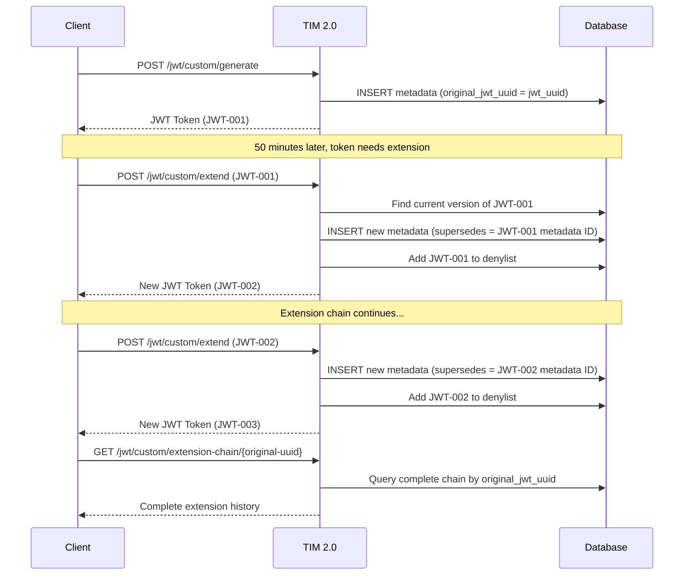

# TIM 2.0 API Reference

## Base URL
```
Production: https://your-domain.com
Development: http://localhost:8080
```

## Authentication
TIM 2.0 endpoints are currently open for demonstration purposes. In production, implement proper authentication.

## API Endpoints

### OAuth 2.0 Endpoints (`/auth/*`)

#### Generate OAuth JWT
```http
POST /auth/jwt/generate
Content-Type: application/json

{
  "subject": "user123",
  "expirationInMinutes": 60,
  "audience": ["api-service"],
  "customClaims": {
    "role": "admin",
    "permissions": ["read", "write"]
  }
}
```

**Response:**
```json
{
  "token": "eyJhbGciOiJSUzI1NiIsInR5cCI6IkpXVCJ9...",
  "expiresIn": 3600,
  "tokenType": "Bearer"
}
```

### Custom JWT Endpoints (`/jwt/custom/*`)

#### Generate Custom JWT
```http
POST /jwt/custom/generate
Content-Type: application/json

{
  "JWTName": "USER_SESSION",
  "content": {
    "sub": "user123",
    "role": "admin",
    "department": "engineering"
  },
  "expirationInMinutes": 120,
  "setCookie": false
}
```

**Response:**
```json
{
  "token": "eyJhbGciOiJSUzI1NiIsInR5cCI6IkpXVCJ9...",
  "jwtUuid": "12345678-1234-1234-1234-123456789012",
  "expiresAt": "2024-01-15T12:00:00Z",
  "jwtName": "USER_SESSION"
}
```

#### Extend JWT Lifetime
```http
POST /jwt/custom/extend
Content-Type: application/json

{
  "token": "eyJhbGciOiJSUzI1NiIsInR5cCI6IkpXVCJ9...",
  "expirationInMinutes": 180
}
```

**Response:**
```json
{
  "token": "eyJhbGciOiJSUzI1NiIsInR5cCI6IkpXVCJ9...",
  "jwtUuid": "87654321-4321-4321-4321-210987654321",
  "expiresAt": "2024-01-15T15:00:00Z",
  "supersedes": "12345678-1234-1234-1234-123456789012",
  "originalJwtUuid": "12345678-1234-1234-1234-123456789012"
}
```

#### Get Extension Chain
```http
GET /jwt/custom/extension-chain/{originalJwtUuid}
```

**Response:**
```json
{
  "originalJwtUuid": "12345678-1234-1234-1234-123456789012",
  "chainLength": 3,
  "extensions": [
    {
      "jwtUuid": "12345678-1234-1234-1234-123456789012",
      "createdAt": "2024-01-15T09:00:00Z",
      "expiresAt": "2024-01-15T10:00:00Z",
      "supersedes": null,
      "status": "revoked"
    },
    {
      "jwtUuid": "87654321-4321-4321-4321-210987654321",
      "createdAt": "2024-01-15T09:50:00Z",
      "expiresAt": "2024-01-15T11:50:00Z",
      "supersedes": "12345678-1234-1234-1234-123456789012",
      "status": "revoked"
    },
    {
      "jwtUuid": "11111111-1111-1111-1111-111111111111",
      "createdAt": "2024-01-15T11:40:00Z",
      "expiresAt": "2024-01-15T14:40:00Z",
      "supersedes": "87654321-4321-4321-4321-210987654321",
      "status": "active"
    }
  ]
}
```

### Token Introspection (RFC 7662)

#### Introspect Token
```http
POST /introspect
Content-Type: application/x-www-form-urlencoded

token=eyJhbGciOiJSUzI1NiIsInR5cCI6IkpXVCJ9...
```

**Response (Active Token):**
```json
{
  "active": true,
  "sub": "user123",
  "aud": ["api-service"],
  "iss": "TIM",
  "exp": 1705327200,
  "iat": 1705323600,
  "jti": "11111111-1111-1111-1111-111111111111",
  "jwt_name": "USER_SESSION",
  "original_jwt_uuid": "12345678-1234-1234-1234-123456789012",
  "extension_count": 2,
  "supersedes": "87654321-4321-4321-4321-210987654321",
  "created_at": 1705323600
}
```

**Response (Inactive Token):**
```json
{
  "active": false
}
```

## Extension Chain Flow



## Error Responses

### Standard Error Format
```json
{
  "error": "invalid_token",
  "error_description": "The provided token is expired or invalid",
  "timestamp": "2024-01-15T12:00:00Z",
  "path": "/jwt/custom/extend"
}
```

### Common Error Codes

| HTTP Code | Error Code | Description |
|-----------|------------|-------------|
| 400 | `invalid_request` | Malformed request body or parameters |
| 401 | `invalid_token` | Token is expired, revoked, or malformed |
| 404 | `token_not_found` | Token metadata not found in system |
| 422 | `validation_error` | Request validation failed |
| 500 | `internal_error` | Internal server error |

## Rate Limits

- **JWT Generation**: 100 requests per minute per IP
- **Token Introspection**: 1000 requests per minute per IP
- **Extension Operations**: 50 requests per minute per IP

## OpenAPI Specification

The complete OpenAPI 3.0 specification is available at:
- **Swagger UI**: [/swagger-ui.html](http://localhost:8080/swagger-ui.html)
- **OpenAPI JSON**: [/v3/api-docs](http://localhost:8080/v3/api-docs)
- **OpenAPI YAML**: [/v3/api-docs.yaml](http://localhost:8080/v3/api-docs.yaml)

## Code Examples

### JavaScript/Node.js
```javascript
// Generate JWT
const response = await fetch('http://localhost:8080/jwt/custom/generate', {
  method: 'POST',
  headers: { 'Content-Type': 'application/json' },
  body: JSON.stringify({
    JWTName: 'USER_TOKEN',
    content: { sub: 'user123', role: 'admin' },
    expirationInMinutes: 60
  })
});
const { token } = await response.json();

// Extend JWT
const extendResponse = await fetch('http://localhost:8080/jwt/custom/extend', {
  method: 'POST',
  headers: { 'Content-Type': 'application/json' },
  body: JSON.stringify({
    token: token,
    expirationInMinutes: 120
  })
});
```

### Python
```python
import requests

# Generate JWT
response = requests.post('http://localhost:8080/jwt/custom/generate', json={
    'JWTName': 'USER_TOKEN',
    'content': {'sub': 'user123', 'role': 'admin'},
    'expirationInMinutes': 60
})
token = response.json()['token']

# Introspect token
introspect_response = requests.post('http://localhost:8080/introspect',
    data={'token': token})
token_info = introspect_response.json()
```

### cURL
```bash
# Generate JWT
curl -X POST http://localhost:8080/jwt/custom/generate \
  -H "Content-Type: application/json" \
  -d '{
    "JWTName": "USER_TOKEN",
    "content": {"sub": "user123", "role": "admin"},
    "expirationInMinutes": 60
  }'

# Extend JWT (replace TOKEN with actual token)
curl -X POST http://localhost:8080/jwt/custom/extend \
  -H "Content-Type: application/json" \
  -d '{
    "token": "TOKEN",
    "expirationInMinutes": 120
  }'

# Introspect token
curl -X POST http://localhost:8080/introspect \
  -H "Content-Type: application/x-www-form-urlencoded" \
  -d "token=TOKEN"
```