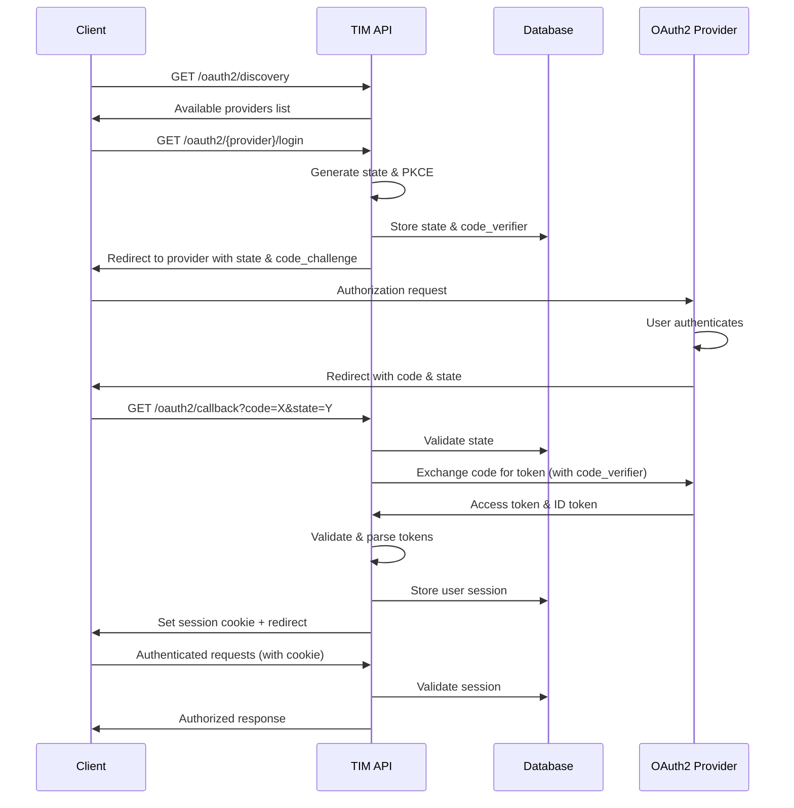
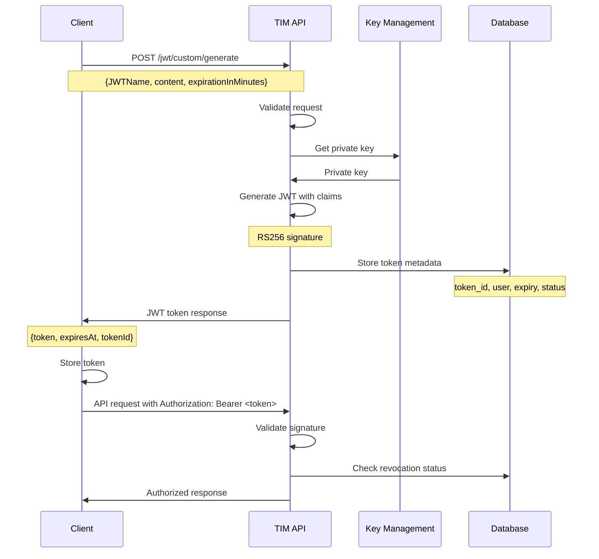
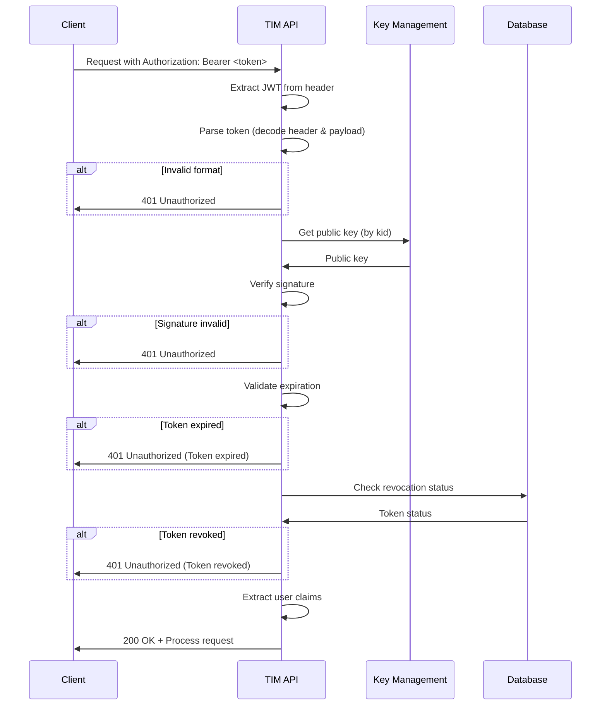
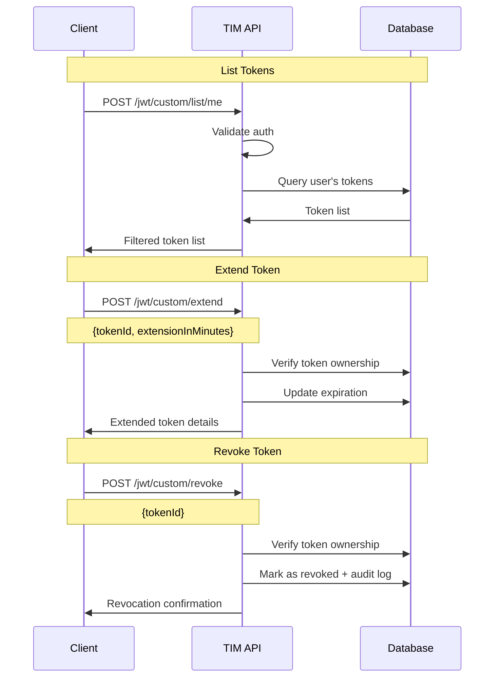
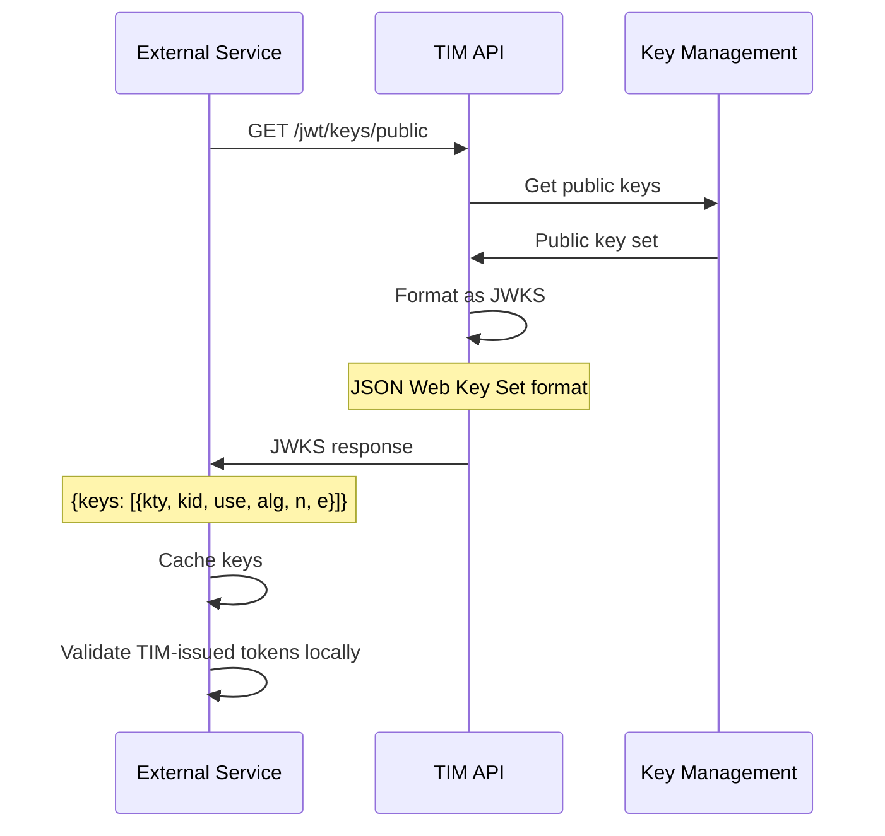
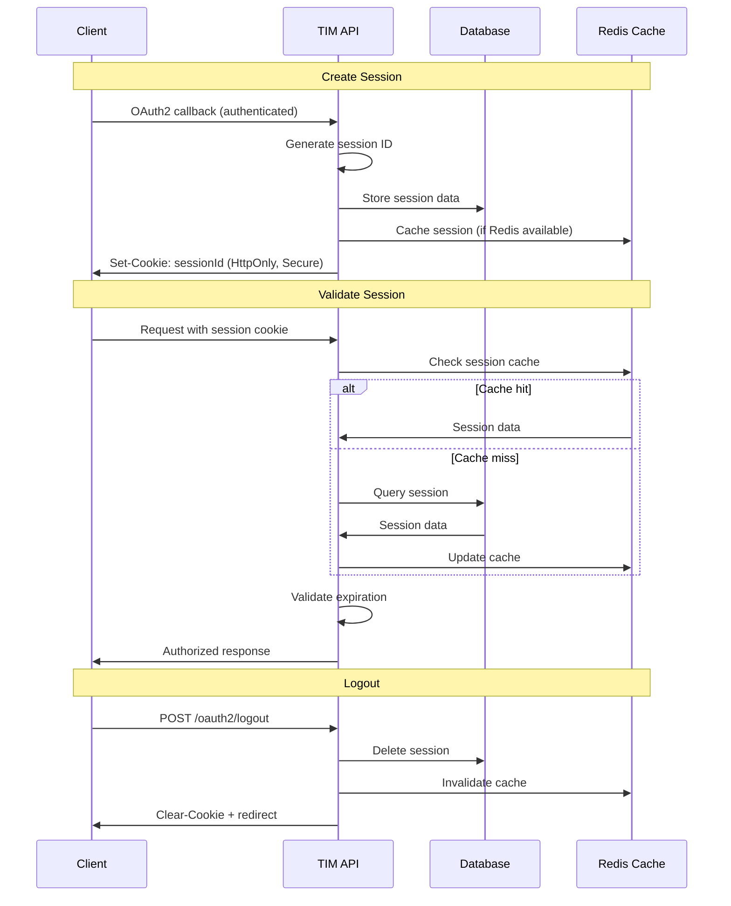

# TIM 2.0 Data Flow Documentation

This document describes the key data flows within TIM 2.0 for different authentication and token management scenarios.

## OAuth2 Authentication Flow

## Custom JWT Generation Flow

## Token Validation Flow

## Token Lifecycle Management Flow

## Public Key Distribution Flow

## Session Management Flow

## Data Storage Patterns

### Token Metadata Storage
- **token_id**: Unique identifier (UUID)
- **user_sub**: User subject claim
- **jwt_name**: Token name/label
- **issued_at**: Creation timestamp
- **expires_at**: Expiration timestamp
- **revoked**: Boolean status
- **revoked_at**: Revocation timestamp (if applicable)

### OAuth2 State Storage
- **state**: Random state parameter
- **provider**: Provider identifier
- **code_verifier**: PKCE code verifier
- **created_at**: State creation time
- **expires_at**: State expiration (short-lived)

### Session Storage
- **session_id**: Unique session identifier
- **user_sub**: Authenticated user
- **provider**: Authentication provider
- **created_at**: Session start
- **expires_at**: Session expiration
- **last_activity**: Last request timestamp
