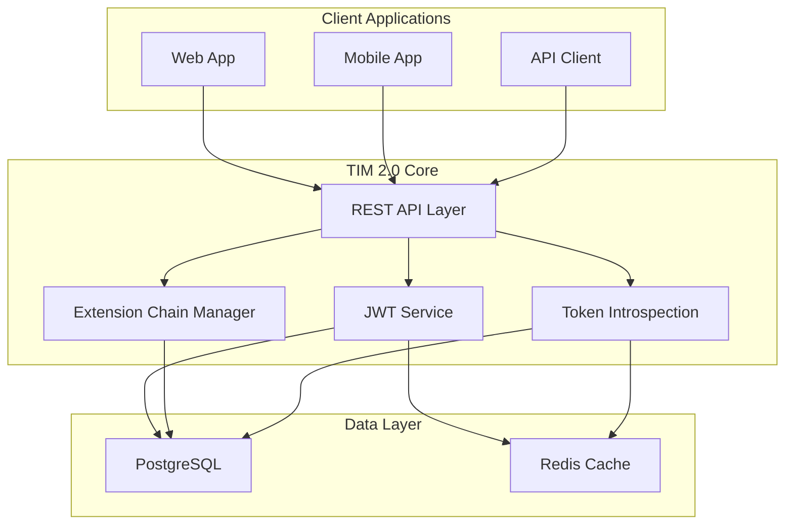
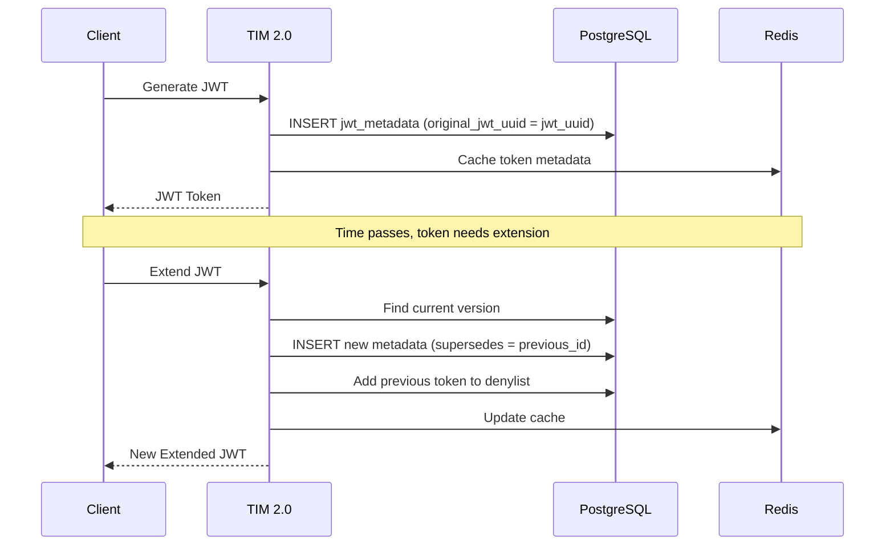
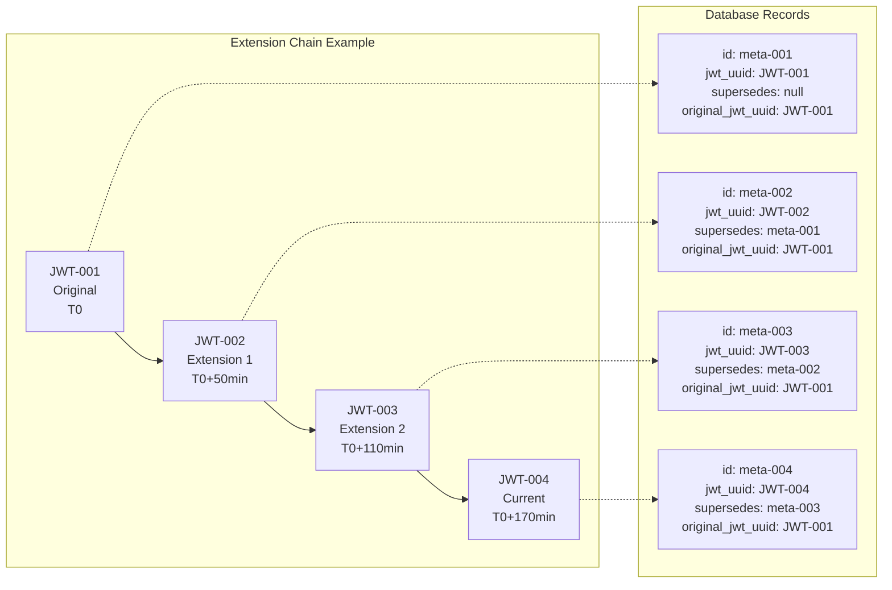

# TIM 2.0 Architecture

## High-Level Architecture



## Core Components

### 1. REST API Layer
- **OAuth 2.0 Endpoints** (`/auth/*`) - Standard OAuth 2.0 flows
- **Custom JWT Endpoints** (`/jwt/custom/*`) - Advanced JWT management
- **Introspection Endpoint** (`/introspect`) - RFC 7662 compliant token validation

### 2. JWT Extension Chain System

The extension chain is TIM 2.0's core innovation, providing complete audit trails for token lifecycle management.



### 3. Database Schema Design

#### JWT Metadata Table
```sql
CREATE TABLE custom_jwt.jwt_metadata (
  id uuid PRIMARY KEY DEFAULT gen_random_uuid(),
  jwt_uuid uuid NOT NULL,
  created_at timestamp NOT NULL DEFAULT now(),
  claim_keys text NOT NULL,
  issued_at timestamp NOT NULL,
  expires_at timestamp NOT NULL,
  subject text,
  jwt_name text,
  audience text,
  issuer text,
  supersedes uuid,              -- Previous version this JWT replaces
  original_jwt_uuid uuid NOT NULL  -- First JWT in the extension chain
);
```

#### Key Design Principles
- **INSERT-Only Operations** - No UPDATE queries ensure data integrity
- **Immutable Audit Trail** - Complete chronological history preserved
- **Extension Chain Tracking** - `supersedes` and `original_jwt_uuid` maintain relationships
- **Performance Optimized** - Strategic indexes for sub-millisecond queries

### 4. Extension Chain Visualization



## Deployment Architecture


### Container Configuration
- **TIM 2.0 Application**: Spring Boot app with embedded Tomcat
- **PostgreSQL**: Database with custom schemas and optimized indexes
- **Redis**: Token metadata caching and session management

## Security Architecture

### Token Security
- **RSA-256 Signing** - Cryptographically secure token signing
- **Automatic Revocation** - Previous tokens revoked on extension
- **Denylist Management** - Revoked tokens tracked and validated

### Database Security
- **Schema Isolation** - Separate schemas for different token types
- **Audit Trail Protection** - INSERT-only design prevents tampering
- **Index Security** - Performance indexes don't expose sensitive data

### Network Security
- **HTTPS Enforcement** - All communications encrypted
- **CORS Configuration** - Controlled cross-origin access
- **Rate Limiting** - Protection against abuse

## Performance Characteristics

### Query Optimization
| Operation | Index Used | Notes |
|-----------|------------|-------|
| Find current JWT version | `idx_jwt_uuid_created` | Finds latest version by timestamp |
| Extension chain lookup | `idx_original_jwt_uuid` | Retrieves complete chain history |
| Token introspection | `idx_jwt_uuid_created` | Fast metadata lookup |
| User token list | `idx_subject` | Subject-based token queries |

### Scalability
- **Horizontal Scaling** - Stateless application design
- **Database Optimization** - Efficient queries with proper indexing
- **Caching Strategy** - Redis for frequently accessed data
- **Container Architecture** - Docker-first deployment approach

## Comparison with KeyCloak

| Aspect | KeyCloak | TIM 2.0 |
|--------|----------|---------|
| **Architecture** | Monolithic, complex | Microservice-ready, simple |
| **Deployment** | Multiple services, complex config | Single container, minimal config |
| **JWT Management** | Basic generation/validation | Advanced extension chains |
| **Audit Trails** | Limited logging | Complete immutable history |
| **Database Design** | Traditional CRUD | INSERT-only, audit-focused |
| **Resource Model** | Multi-service architecture | Single container architecture |
| **Customization** | Theme/plugin system | API-first, developer-friendly |
| **Token Introspection** | RFC 7662 compliant | RFC 7662 + extension metadata |

## Future Architecture Considerations

### Planned Enhancements
1. **Distributed Deployment** - Multi-region support
2. **Advanced Caching** - Distributed cache with Redis Cluster
3. **Monitoring Integration** - Prometheus metrics and Grafana dashboards
4. **Event Streaming** - Kafka integration for audit events
5. **API Gateway Integration** - Direct integration with popular gateways