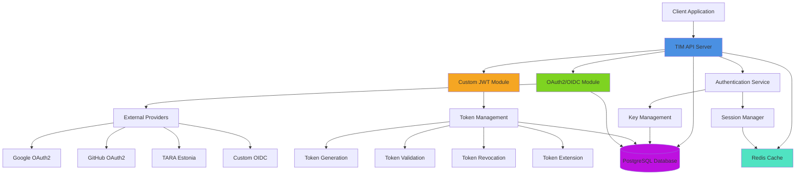
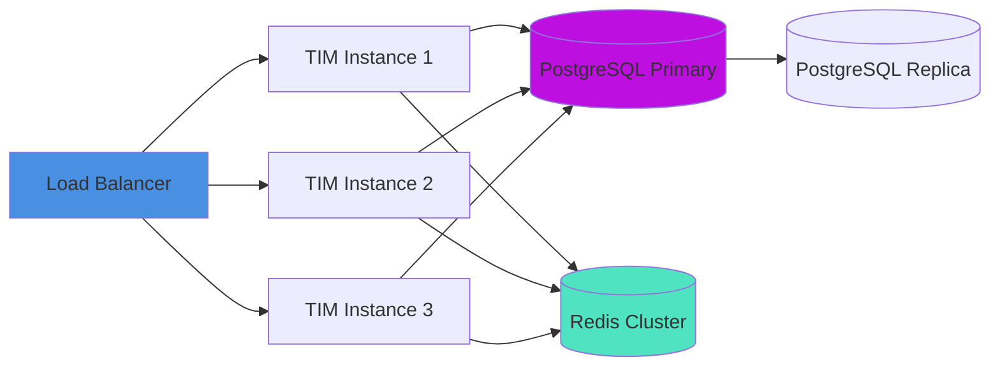

# TIM 2.0 Architecture Overview

## System Components

TIM 2.0 is built as a modular Spring Boot application with distinct functional modules that work together to provide comprehensive token identity management.

## Core Modules

### 1. API Server
- Central entry point for all client requests
- RESTful API endpoints
- Request routing and validation
- Security enforcement (CORS, CSRF)
- OpenAPI/Swagger documentation

### 2. OAuth2/OIDC Module
- Provider discovery and configuration
- OAuth2 authorization code flow
- PKCE (Proof Key for Code Exchange) support
- State parameter management for CSRF protection
- Token exchange with external providers
- Session management with secure cookies

### 3. Custom JWT Module
- Custom JWT token generation
- Token lifecycle management (create, list, extend, revoke)
- RSA256 signature generation and validation
- Token metadata tracking
- Audit logging

### 4. Authentication Service
- Unified authentication interface
- JWT validation and parsing
- User identity extraction
- Session management
- Authorization checks

### 5. Key Management
- RSA key pair generation
- Key rotation support
- Public key exposure (JWKS endpoint)
- Secure private key storage

### 6. Database Layer
- PostgreSQL persistence
- Token storage and indexing
- OAuth2 state management
- Session storage
- Audit logs

### 7. Caching Layer (Optional)
- Redis-based session caching
- Token validation caching
- Performance optimization

## Security Architecture

### Token Signing
- RSA256 (RS256) algorithm
- 2048-bit RSA key pairs
- Private keys stored encrypted
- Public keys exposed via JWKS endpoint

### Session Security
- HttpOnly cookies
- Secure flag in production
- SameSite attribute
- Configurable expiration
- Token binding to sessions

### CSRF Protection
- State parameter validation in OAuth2 flows
- Random state generation
- State expiration tracking

### Token Revocation
- Immediate revocation capability
- Revocation list checking
- Audit trail for all revocations

## Deployment Architecture

## Technology Stack

- **Runtime**: Java 17+
- **Framework**: Spring Boot 3.x
- **Database**: PostgreSQL 14+
- **Cache**: Redis (optional)
- **API Documentation**: OpenAPI 3.1 / Swagger
- **Build Tool**: Maven
- **Containerization**: Docker / Docker Compose

## Design Principles

1. **Provider Agnostic**: Support any OAuth2/OIDC compliant provider without code changes
2. **Security First**: Industry-standard encryption, secure defaults, comprehensive audit logging
3. **High Performance**: Optimized queries, caching strategies, horizontal scalability
4. **Developer Friendly**: Clear API design, comprehensive documentation, runnable examples
5. **Operational Excellence**: Health checks, metrics, structured logging, easy deployment
