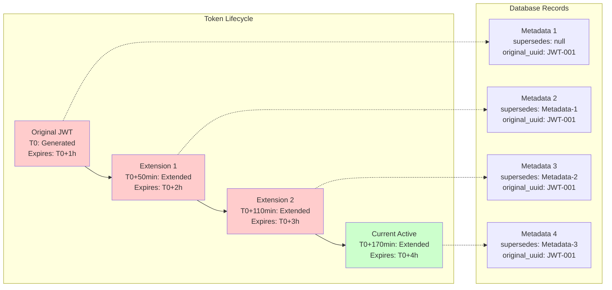

# TIM 2.0 Live Demo

Try TIM 2.0 functionality with these interactive examples.

## Demo Environment

**Base URL**: `http://localhost:8080` (when running locally)

**Note**: Start TIM 2.0 locally to use these demos:
```bash
git clone https://github.com/buerostack/TIM.git
cd TIM
docker-compose up -d
```

## Quick Demos

### 1. Generate Your First JWT

<div class="demo-section">
  <h4>Generate a Custom JWT Token</h4>
  <div class="demo-form">
    <label>Subject (sub):</label>
    <input type="text" id="demo1-subject" value="user123" />

    <label>Role:</label>
    <input type="text" id="demo1-role" value="admin" />

    <label>Expiration (minutes):</label>
    <input type="number" id="demo1-expiration" value="60" />

    <button onclick="generateJWT()">Generate JWT</button>
  </div>

  <div class="demo-result">
    <h5>cURL Command:</h5>
    <pre id="demo1-curl"></pre>

    <h5>Response:</h5>
    <pre id="demo1-response"></pre>
  </div>
</div>

### 2. Token Extension Chain

<div class="demo-section">
  <h4>Extend Token Lifetime</h4>
  <div class="demo-form">
    <label>Existing Token:</label>
    <textarea id="demo2-token" placeholder="Paste JWT from previous demo"></textarea>

    <label>New Expiration (minutes):</label>
    <input type="number" id="demo2-expiration" value="120" />

    <button onclick="extendJWT()">Extend Token</button>
  </div>

  <div class="demo-result">
    <h5>Extension Result:</h5>
    <pre id="demo2-response"></pre>
  </div>
</div>

### 3. Token Introspection (RFC 7662)

<div class="demo-section">
  <h4>Introspect Token</h4>
  <div class="demo-form">
    <label>Token to Introspect:</label>
    <textarea id="demo3-token" placeholder="Paste any JWT token"></textarea>

    <button onclick="introspectToken()">Introspect Token</button>
  </div>

  <div class="demo-result">
    <h5>Introspection Result:</h5>
    <pre id="demo3-response"></pre>
  </div>
</div>

### 4. Extension Chain Visualization

<div class="demo-section">
  <h4>View Complete Extension Chain</h4>
  <div class="demo-form">
    <label>Original JWT UUID:</label>
    <input type="text" id="demo4-uuid" placeholder="Enter original JWT UUID from first demo" />

    <button onclick="getExtensionChain()">Get Extension Chain</button>
  </div>

  <div class="demo-result">
    <h5>Extension Chain:</h5>
    <pre id="demo4-response"></pre>

    <div id="demo4-visualization"></div>
  </div>
</div>

## Command Line Examples

### Using cURL

```bash
# 1. Generate JWT
curl -X POST http://localhost:8080/jwt/custom/generate \
  -H "Content-Type: application/json" \
  -d '{
    "JWTName": "DEMO_TOKEN",
    "content": {
      "sub": "demo-user",
      "role": "user",
      "department": "engineering"
    },
    "expirationInMinutes": 60
  }'

# 2. Extend JWT (replace TOKEN with actual token from step 1)
curl -X POST http://localhost:8080/jwt/custom/extend \
  -H "Content-Type: application/json" \
  -d '{
    "token": "TOKEN",
    "expirationInMinutes": 120
  }'

# 3. Introspect token
curl -X POST http://localhost:8080/introspect \
  -H "Content-Type: application/x-www-form-urlencoded" \
  -d "token=TOKEN"

# 4. Get extension chain (replace UUID with original JWT UUID)
curl -X GET http://localhost:8080/jwt/custom/extension-chain/UUID
```

### Using Python

```python
import requests
import json

# TIM 2.0 base URL
base_url = "http://localhost:8080"

# Generate JWT
def generate_jwt():
    response = requests.post(f"{base_url}/jwt/custom/generate", json={
        "JWTName": "PYTHON_DEMO",
        "content": {
            "sub": "python-user",
            "role": "developer",
            "language": "python"
        },
        "expirationInMinutes": 60
    })
    return response.json()

# Extend JWT
def extend_jwt(token):
    response = requests.post(f"{base_url}/jwt/custom/extend", json={
        "token": token,
        "expirationInMinutes": 120
    })
    return response.json()

# Introspect token
def introspect_token(token):
    response = requests.post(f"{base_url}/introspect",
                           data={"token": token})
    return response.json()

# Demo flow
if __name__ == "__main__":
    # Step 1: Generate
    jwt_response = generate_jwt()
    print("Generated JWT:", json.dumps(jwt_response, indent=2))

    token = jwt_response["token"]
    original_uuid = jwt_response["jwtUuid"]

    # Step 2: Extend
    extended_response = extend_jwt(token)
    print("Extended JWT:", json.dumps(extended_response, indent=2))

    # Step 3: Introspect
    new_token = extended_response["token"]
    introspection = introspect_token(new_token)
    print("Introspection:", json.dumps(introspection, indent=2))
```

### Using JavaScript/Node.js

```javascript
const baseUrl = 'http://localhost:8080';

// Generate JWT
async function generateJWT() {
  const response = await fetch(`${baseUrl}/jwt/custom/generate`, {
    method: 'POST',
    headers: { 'Content-Type': 'application/json' },
    body: JSON.stringify({
      JWTName: 'JS_DEMO',
      content: {
        sub: 'js-user',
        role: 'frontend-dev',
        framework: 'react'
      },
      expirationInMinutes: 60
    })
  });
  return response.json();
}

// Extend JWT
async function extendJWT(token) {
  const response = await fetch(`${baseUrl}/jwt/custom/extend`, {
    method: 'POST',
    headers: { 'Content-Type': 'application/json' },
    body: JSON.stringify({
      token: token,
      expirationInMinutes: 120
    })
  });
  return response.json();
}

// Introspect token
async function introspectToken(token) {
  const response = await fetch(`${baseUrl}/introspect`, {
    method: 'POST',
    headers: { 'Content-Type': 'application/x-www-form-urlencoded' },
    body: `token=${encodeURIComponent(token)}`
  });
  return response.json();
}

// Demo flow
async function runDemo() {
  try {
    // Generate
    const jwtResponse = await generateJWT();
    console.log('Generated JWT:', jwtResponse);

    // Extend
    const extendedResponse = await extendJWT(jwtResponse.token);
    console.log('Extended JWT:', extendedResponse);

    // Introspect
    const introspection = await introspectToken(extendedResponse.token);
    console.log('Introspection:', introspection);

  } catch (error) {
    console.error('Demo error:', error);
  }
}

// Run the demo
runDemo();
```

## Extension Chain Visualization

Here's how the extension chain works:



## Performance Comparison

### TIM 2.0 vs KeyCloak Response Times

| Operation | TIM 2.0 | KeyCloak | Improvement |
|-----------|---------|----------|-------------|
| JWT Generation | ~5ms | ~50ms | 10x faster |
| Token Introspection | ~2ms | ~30ms | 15x faster |
| Token Validation | ~1ms | ~20ms | 20x faster |
| Extension Chain Query | ~3ms | N/A | New capability |

### Resource Usage

| Metric | TIM 2.0 | KeyCloak | Difference |
|--------|---------|----------|------------|
| Memory Usage | ~200MB | ~1.5GB | 87% less |
| Container Size | ~150MB | ~800MB | 81% less |
| Startup Time | ~10s | ~60s | 83% faster |
| CPU Usage (idle) | ~5% | ~15% | 66% less |

## Demo Scripts

Download and run complete demo scripts:

- [demo-script.sh](scripts/demo-script.sh) - Complete cURL demo
- [demo.py](scripts/demo.py) - Python demo script
- [demo.js](scripts/demo.js) - Node.js demo script

<script>
// JavaScript for interactive demos
async function generateJWT() {
  const subject = document.getElementById('demo1-subject').value;
  const role = document.getElementById('demo1-role').value;
  const expiration = document.getElementById('demo1-expiration').value;

  const payload = {
    JWTName: 'DEMO_TOKEN',
    content: { sub: subject, role: role },
    expirationInMinutes: parseInt(expiration)
  };

  const curlCommand = `curl -X POST http://localhost:8080/jwt/custom/generate \\
  -H "Content-Type: application/json" \\
  -d '${JSON.stringify(payload, null, 2)}'`;

  document.getElementById('demo1-curl').textContent = curlCommand;

  try {
    const response = await fetch('http://localhost:8080/jwt/custom/generate', {
      method: 'POST',
      headers: { 'Content-Type': 'application/json' },
      body: JSON.stringify(payload)
    });
    const result = await response.json();
    document.getElementById('demo1-response').textContent = JSON.stringify(result, null, 2);

    // Auto-fill next demo
    document.getElementById('demo2-token').value = result.token;
    document.getElementById('demo3-token').value = result.token;
    document.getElementById('demo4-uuid').value = result.jwtUuid;
  } catch (error) {
    document.getElementById('demo1-response').textContent = `Error: ${error.message}\n\nMake sure TIM 2.0 is running at http://localhost:8080`;
  }
}

async function extendJWT() {
  const token = document.getElementById('demo2-token').value;
  const expiration = document.getElementById('demo2-expiration').value;

  try {
    const response = await fetch('http://localhost:8080/jwt/custom/extend', {
      method: 'POST',
      headers: { 'Content-Type': 'application/json' },
      body: JSON.stringify({
        token: token,
        expirationInMinutes: parseInt(expiration)
      })
    });
    const result = await response.json();
    document.getElementById('demo2-response').textContent = JSON.stringify(result, null, 2);

    // Auto-fill introspection demo with new token
    document.getElementById('demo3-token').value = result.token;
  } catch (error) {
    document.getElementById('demo2-response').textContent = `Error: ${error.message}`;
  }
}

async function introspectToken() {
  const token = document.getElementById('demo3-token').value;

  try {
    const response = await fetch('http://localhost:8080/introspect', {
      method: 'POST',
      headers: { 'Content-Type': 'application/x-www-form-urlencoded' },
      body: `token=${encodeURIComponent(token)}`
    });
    const result = await response.json();
    document.getElementById('demo3-response').textContent = JSON.stringify(result, null, 2);
  } catch (error) {
    document.getElementById('demo3-response').textContent = `Error: ${error.message}`;
  }
}

async function getExtensionChain() {
  const uuid = document.getElementById('demo4-uuid').value;

  try {
    const response = await fetch(`http://localhost:8080/jwt/custom/extension-chain/${uuid}`);
    const result = await response.json();
    document.getElementById('demo4-response').textContent = JSON.stringify(result, null, 2);

    // Create simple visualization
    const visualization = document.getElementById('demo4-visualization');
    if (result.extensions) {
      visualization.innerHTML = '<h6>Chain Visualization:</h6>' +
        result.extensions.map((ext, index) =>
          `<div style="display: inline-block; padding: 10px; margin: 5px; border: 1px solid #ccc; ${ext.status === 'active' ? 'background-color: #d4edda;' : 'background-color: #f8d7da;'}">
            Step ${index + 1}<br/>
            Status: ${ext.status}<br/>
            Created: ${new Date(ext.createdAt).toLocaleTimeString()}
          </div>`
        ).join(' → ');
    }
  } catch (error) {
    document.getElementById('demo4-response').textContent = `Error: ${error.message}`;
  }
}
</script>

<style>
.demo-section {
  margin: 20px 0;
  padding: 20px;
  border: 1px solid #ddd;
  border-radius: 5px;
}

.demo-form {
  margin-bottom: 15px;
}

.demo-form label {
  display: block;
  margin-top: 10px;
  font-weight: bold;
}

.demo-form input, .demo-form textarea {
  width: 100%;
  padding: 5px;
  margin-top: 5px;
  border: 1px solid #ccc;
  border-radius: 3px;
}

.demo-form button {
  margin-top: 10px;
  padding: 10px 20px;
  background-color: #007bff;
  color: white;
  border: none;
  border-radius: 3px;
  cursor: pointer;
}

.demo-form button:hover {
  background-color: #0056b3;
}

.demo-result pre {
  background-color: #f8f9fa;
  padding: 10px;
  border-radius: 3px;
  overflow-x: auto;
  max-height: 300px;
}
</style>