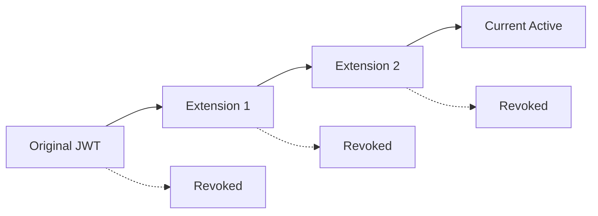

# TIM 2.0 - Token Identity Manager

A JWT management system with built-in extension chains and RFC 7662 Token Introspection support.

## Overview

TIM 2.0 is designed as a modern alternative to complex identity management solutions like KeyCloak. It provides:

- **Simple JWT Generation & Management** - Generate, extend, and manage JWT tokens with minimal configuration
- **Extension Chain Audit Trails** - Complete immutable history of token extensions and modifications
- **RFC 7662 Token Introspection** - Standards-compliant token validation and metadata retrieval
- **INSERT-Only Architecture** - Database design that ensures data integrity and audit compliance
- **Docker-First Deployment** - Single container deployment with PostgreSQL backend

## Quick Start

### Running TIM 2.0

```bash
# Clone the repository
git clone https://github.com/buerostack/TIM.git
cd TIM

# Start with Docker Compose
docker-compose up -d

# TIM 2.0 will be available at:
# http://localhost:8080
```

### Basic Usage

#### Generate a Custom JWT
```bash
curl -X POST http://localhost:8080/jwt/custom/generate \
  -H "Content-Type: application/json" \
  -d '{
    "JWTName": "USER_TOKEN",
    "content": {
      "sub": "user123",
      "role": "admin"
    },
    "expirationInMinutes": 60
  }'
```

#### Extend Token Lifetime
```bash
curl -X POST http://localhost:8080/jwt/custom/extend \
  -H "Content-Type: application/json" \
  -d '{
    "token": "eyJhbGciOiJSUzI1NiIs...",
    "expirationInMinutes": 120
  }'
```

#### Token Introspection (RFC 7662)
```bash
curl -X POST http://localhost:8080/introspect \
  -H "Content-Type: application/x-www-form-urlencoded" \
  -d "token=eyJhbGciOiJSUzI1NiIs..."
```

## Documentation

- [Architecture Overview](architecture/)
- [API Reference](api/)
- [KeyCloak Migration Guide](migration/)
- [Deployment Guide](deployment/)
- [Security Features](security/)

## Key Features

### Extension Chain Management
TIM 2.0 tracks the complete lifecycle of JWT tokens through extension chains:



### Audit Trail Compliance
- Every token operation is permanently recorded
- INSERT-only database design prevents tampering
- Complete chronological history available for compliance

### Optimized Architecture
- Spring Boot application
- PostgreSQL queries with proper indexing
- Efficient token validation
- Containerized deployment

## KeyCloak Alternative

TIM 2.0 can replace KeyCloak in scenarios requiring:

| Feature | KeyCloak | TIM 2.0 |
|---------|----------|---------|
| Setup Complexity | Multiple services, complex config | Single container |
| JWT Management | Standard JWT features | Extension chains with audit trails |
| Audit Trails | Basic logging | Complete immutable history |
| Deployment | Multi-component setup | Docker-first, single container |
| Token Introspection | RFC 7662 compliant | RFC 7662 compliant + extension metadata |

## Live Demo

Try TIM 2.0 functionality:

- [Interactive API Explorer](demo/)
- [Extension Chain Visualization](demo/extension-chain/)
- [Performance Comparison](demo/performance/)

## Contributing

TIM 2.0 is open source and welcomes contributions. See our [Contributing Guide](contributing/) for details.

## License

TIM 2.0 is licensed under the MIT License. See [LICENSE](https://github.com/buerostack/TIM/blob/main/LICENSE) for details.