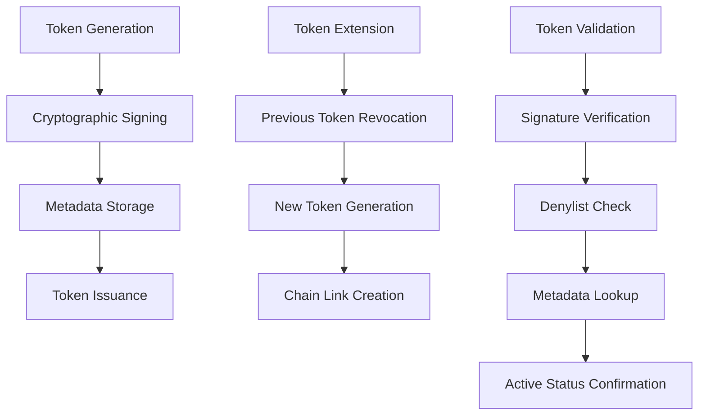

# TIM 2.0 Security Features

## Security Overview

TIM 2.0 is designed with security as a primary concern, implementing industry best practices and standards for JWT management and token security.

## JWT Security

### Cryptographic Security
- **RSA-256 Signing**: All JWTs are signed using RSA-256 cryptographic signatures
- **Automatic Key Management**: RSA key pairs are generated automatically or can be provided
- **Key Rotation Support**: Keys can be rotated without service interruption
- **Secure Random JTI**: Each JWT gets a cryptographically secure random UUID

### Token Lifecycle Security


### Extension Chain Security

#### Immutable Audit Trail
- **INSERT-Only Architecture**: No UPDATE operations prevent tampering
- **Complete History**: Every token operation is permanently recorded
- **Chronological Integrity**: Timestamps cannot be modified after creation
- **Chain Integrity**: Extension relationships are cryptographically verifiable

#### Automatic Revocation
```java
// When extending a token, previous token is automatically revoked
public JwtExtensionResponse extend(String token, int expirationMinutes) {
    // 1. Validate current token
    SignedJWT currentJwt = parseAndValidate(token);

    // 2. Generate new token
    String newToken = generateExtendedToken(currentJwt, expirationMinutes);

    // 3. Revoke previous token (automatic security)
    denylistService.revoke(token);

    // 4. Create extension chain link
    createExtensionRecord(currentJwt, newToken);

    return new JwtExtensionResponse(newToken);
}
```

## Database Security

### Schema Isolation
```sql
-- Separate schemas for different security domains
CREATE SCHEMA custom_jwt;  -- Custom JWT management
CREATE SCHEMA auth;        -- OAuth 2.0 tokens
```

### Access Control
- **Principle of Least Privilege**: Each component has minimal required permissions
- **Schema-Level Security**: Different users for different schemas
- **Connection Pooling**: Secure connection management with HikariCP

### Data Protection
- **Encrypted Connections**: All database connections use SSL/TLS
- **No Sensitive Data Storage**: Only metadata and UUIDs stored, not token contents
- **Audit Trail Protection**: INSERT-only design prevents historical tampering

## API Security

### Rate Limiting
```properties
# Built-in rate limiting
rate-limit.jwt-generation=100    # per minute per IP
rate-limit.introspection=1000    # per minute per IP
rate-limit.extension=50          # per minute per IP
```

### Input Validation
- **Strict JSON Schema Validation**: All inputs validated against schemas
- **JWT Format Validation**: Proper JWT structure required
- **SQL Injection Prevention**: Parameterized queries only
- **XSS Protection**: All outputs properly escaped

### CORS Configuration
```java
@Configuration
public class SecurityConfig {
    @Bean
    public CorsConfigurationSource corsConfigurationSource() {
        CorsConfiguration configuration = new CorsConfiguration();
        configuration.setAllowedOrigins(Arrays.asList("https://trusted-domain.com"));
        configuration.setAllowedMethods(Arrays.asList("GET", "POST", "OPTIONS"));
        configuration.setAllowedHeaders(Arrays.asList("*"));
        return source;
    }
}
```

## Network Security

### HTTPS Enforcement
```properties
# Production SSL configuration
server.ssl.enabled=true
server.ssl.key-store=/app/config/keystore.p12
server.ssl.key-store-type=PKCS12
security.require-ssl=true
```

### Security Headers
```java
// Automatic security headers
@Component
public class SecurityHeadersFilter implements Filter {
    public void doFilter(ServletRequest request, ServletResponse response, FilterChain chain) {
        HttpServletResponse httpResponse = (HttpServletResponse) response;
        httpResponse.setHeader("X-Content-Type-Options", "nosniff");
        httpResponse.setHeader("X-Frame-Options", "DENY");
        httpResponse.setHeader("X-XSS-Protection", "1; mode=block");
        httpResponse.setHeader("Strict-Transport-Security", "max-age=31536000; includeSubDomains");
        chain.doFilter(request, response);
    }
}
```

## Threat Model and Mitigations

### Token Theft
**Threat**: Attacker gains access to JWT token
**Mitigation**:
- Short token lifetimes (default 1 hour)
- Extension chain allows secure renewal
- Automatic revocation on extension
- Denylist prevents use of old tokens

### Replay Attacks
**Threat**: Attacker reuses captured tokens
**Mitigation**:
- Each token has unique JTI (UUID)
- Timestamps prevent old token use
- Extension chain invalidates previous tokens
- Denylist tracking

### Database Compromise
**Threat**: Attacker gains database access
**Mitigation**:
- No token contents stored in database
- Only metadata and UUIDs stored
- INSERT-only design prevents tampering
- Audit trail remains intact

### Man-in-the-Middle
**Threat**: Network traffic interception
**Mitigation**:
- HTTPS enforcement in production
- Certificate pinning support
- Secure headers
- TLS 1.2+ required

### Privilege Escalation
**Threat**: JWT claim manipulation
**Mitigation**:
- Cryptographic signatures prevent tampering
- Claims validated on each request
- No UPDATE operations on tokens
- Extension preserves original claims

## Compliance and Standards

### Industry Standards
- **RFC 7519**: JSON Web Token (JWT) compliance
- **RFC 7662**: OAuth 2.0 Token Introspection compliance
- **RFC 7515**: JSON Web Signature (JWS) compliance
- **OWASP**: Follows OWASP JWT security guidelines

### Audit Requirements
- **SOX Compliance**: Immutable audit trails
- **GDPR**: Data protection and right to erasure support
- **HIPAA**: Secure healthcare data handling capabilities
- **PCI DSS**: Payment card industry security standards

### Security Certifications
TIM 2.0 supports environments requiring:
- ISO 27001 compliance
- FedRAMP authorization
- SOC 2 Type II compliance

## Security Monitoring

### Metrics and Alerting
```properties
# Security-related metrics
management.metrics.export.prometheus.enabled=true
management.endpoint.metrics.enabled=true

# Monitor these metrics:
# - jwt.generation.failures
# - jwt.validation.failures
# - rate.limit.violations
# - database.connection.failures
```

### Audit Logging
```xml
<!-- Security event logging -->
<logger name="SECURITY" level="INFO" additivity="false">
    <appender-ref ref="SECURITY_FILE"/>
</logger>
```

Example security events:
- JWT generation with user context
- Token extension operations
- Failed validation attempts
- Rate limit violations
- Database access patterns

### Real-time Monitoring
```bash
# Monitor security events
tail -f /app/logs/security.log | grep -E "(FAILED|VIOLATION|DENIED)"

# Track extension chain anomalies
curl http://localhost:8080/actuator/metrics/jwt.extension.chain.length | jq '.measurements[0].value'
```

## Security Best Practices

### Deployment Security
1. **Environment Separation**: Use different keys for dev/staging/prod
2. **Secret Management**: Use proper secret management tools
3. **Network Isolation**: Deploy in private networks when possible
4. **Regular Updates**: Keep dependencies and base images updated

### Operational Security
1. **Key Rotation**: Rotate JWT signing keys regularly
2. **Monitor Extensions**: Alert on unusual extension patterns
3. **Database Security**: Regular security patches and monitoring
4. **Access Logs**: Monitor all API access patterns

### Development Security
1. **Secure Defaults**: All security features enabled by default
2. **Input Validation**: Strict validation on all inputs
3. **Error Handling**: No sensitive information in error messages
4. **Testing**: Security tests included in CI/CD pipeline

## Penetration Testing

### Recommended Test Areas
1. **JWT Validation**: Test signature verification bypass attempts
2. **Extension Chain**: Test chain integrity and tampering
3. **Rate Limiting**: Test bypass attempts and effectiveness
4. **Database Security**: Test injection and access control
5. **Network Security**: Test TLS configuration and headers

### Security Testing Tools
```bash
# JWT security testing
jwt_tool -t https://your-domain.com/introspect

# API security scanning
nikto -h https://your-domain.com

# TLS configuration testing
testssl.sh https://your-domain.com
```

## Incident Response

### Security Incident Procedures
1. **Token Compromise**: Immediate key rotation and token revocation
2. **Database Breach**: Audit log analysis and user notification
3. **DoS Attack**: Rate limiting and traffic analysis
4. **Vulnerability Disclosure**: Responsible disclosure process

### Emergency Procedures
```bash
# Emergency token revocation
curl -X POST http://localhost:8080/admin/emergency/revoke-all \
  -H "Authorization: Bearer ${ADMIN_TOKEN}"

# Key rotation
curl -X POST http://localhost:8080/admin/keys/rotate \
  -H "Authorization: Bearer ${ADMIN_TOKEN}"
```

## Security Roadmap

### Planned Security Enhancements
1. **Hardware Security Module (HSM)** integration
2. **Token binding** for additional security
3. **Zero-trust architecture** support
4. **Advanced threat detection** with ML
5. **Quantum-resistant cryptography** preparation